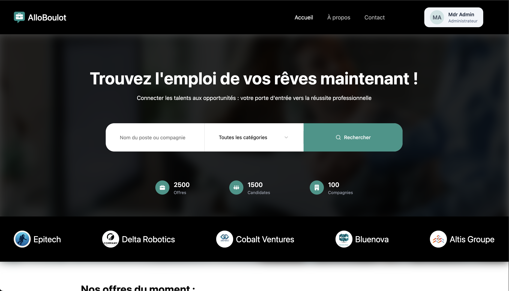
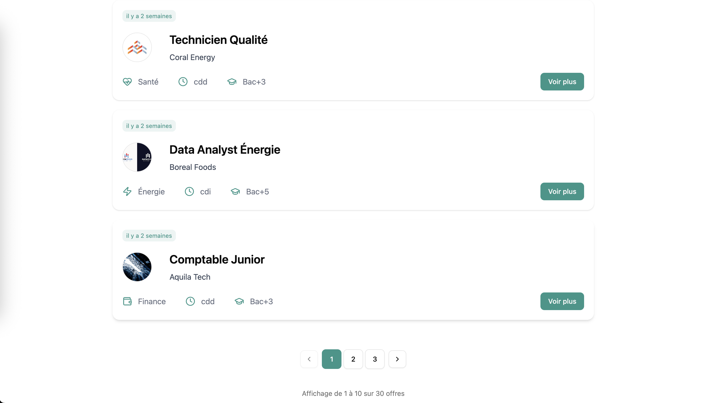
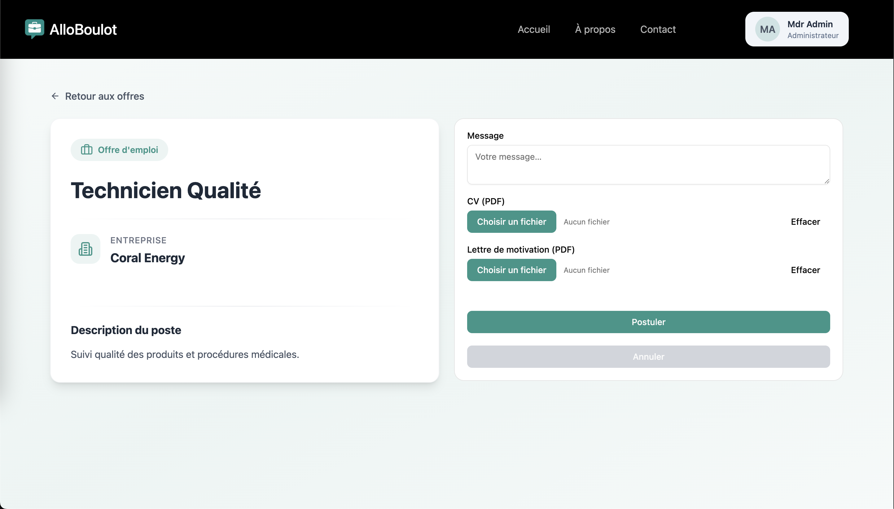
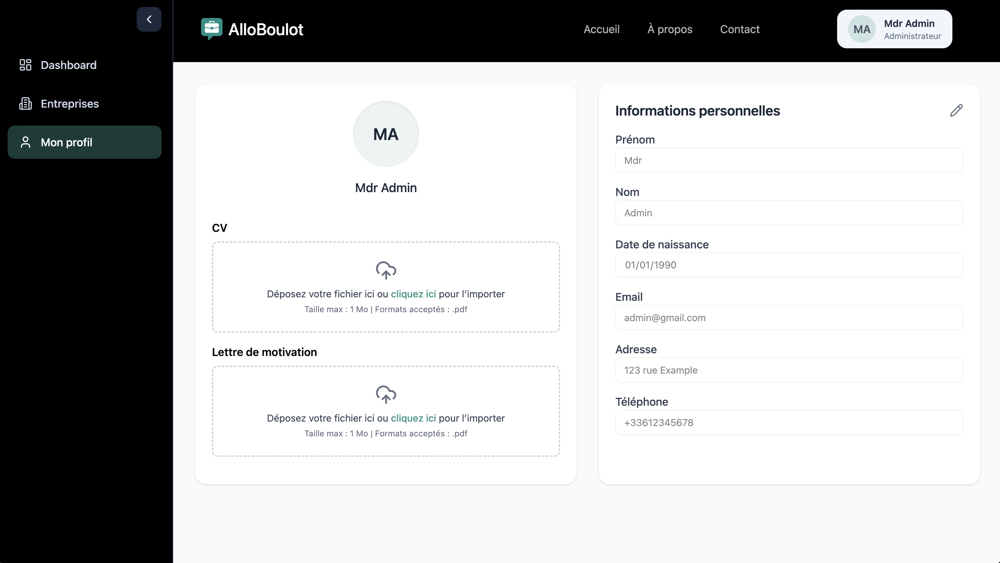
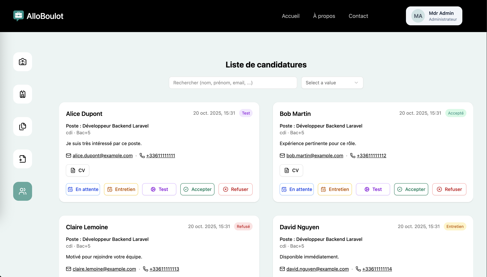
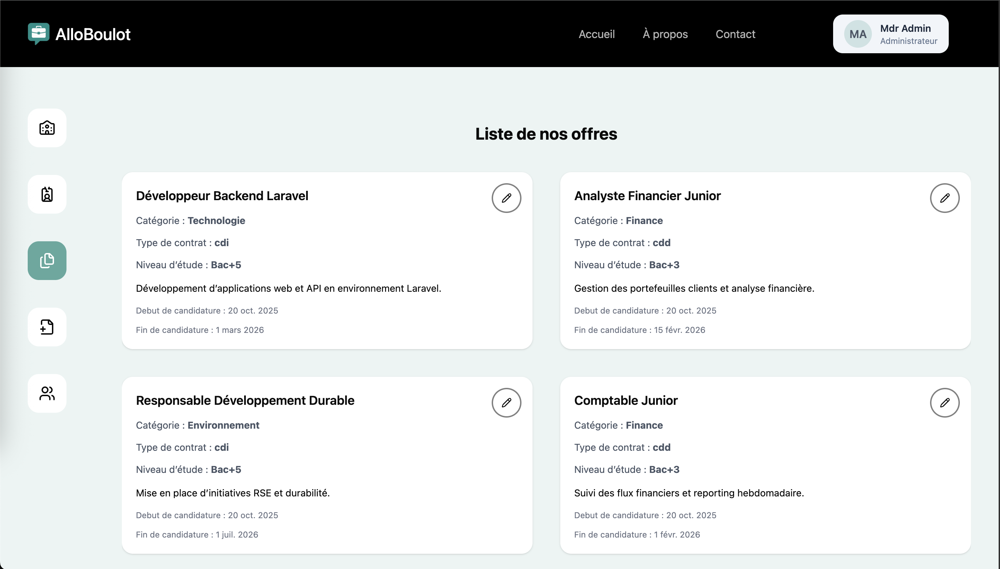
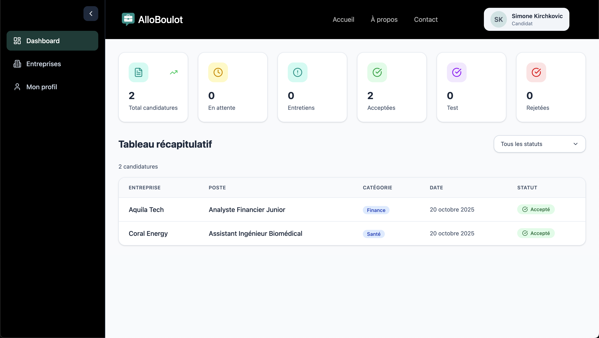

# AlloBoulot

AlloBoulot is a full-stack job search and recruitment platform built with Laravel (Backend) and React + TypeScript (Frontend).


## Overview

AlloBoulot connects job seekers with employers through a modern, user-friendly platform. Companies can post job offers, manage applications, and find the perfect candidates, while job seekers can easily search for opportunities and manage their applications.

## Screens








## Features

### For Job Seekers
- 🔍 Advanced job search with filters
- 📝 Easy application process
- 📊 Application tracking dashboard
- 💼 Profile management
- 📱 Responsive design for mobile access

### For Employers
- 📢 Post and manage job offers
- 👥 Candidate management
- 🏢 Company profile customization
- 👥 Employee management

## Tech Stack

### Backend
- Laravel (PHP Framework)
- MySQL Database
- JWT Authentication
- RESTful API
- L5-Swagger for API Documentation

### Frontend
- React with TypeScript
- Vite
- Zustand for State Management
- ZOD & React Hook Form for form validation
- Tanstack Query
- ShadCn
- Tailwind CSS

### DevOps
- Docker
- Docker Compose

## Getting Started

### Prerequisites
- Docker
- Docker Compose
- Git

### Installation

1. Clone the repository
```bash
git clone git@github.com:EpitechMscProPromo2028/T-WEB-501-MAR_13.git
cd T-WEB-501-MAR_13
cd .docker
```

2. Build and start the containers
```bash
docker compose build --no-cache
docker compose up
```

3. Access the applications
- Frontend: http://localhost:5173
- Backend API: http://localhost:8000
- API Documentation: http://localhost:8000/api/documentation
- PHPMyAdmin: http://localhost:8083

## Project Structure

```
├── docker/.             # Docker files Devops
├── api/                 # Laravel Backend
│   ├── app/
│   ├── config/
│   ├── database/
│   └── routes/
├── client/             # React Frontend
│   ├── src/
│   └── public/
└── docs/               # Documentation
```

## Documentation

- [Backend Documentation](docs/backend.md) - API and backend architecture
- [Frontend Documentation](docs/frontend.md) - Components and state management
- [DevOps Guide](docs/devops.md) - Deployment and infrastructure
- [Deployment Procedures](docs/deployment_procedures.md) - Step-by-step deployment guide

## Development

### Backend Development
```bash
# Access the API container
docker compose exec AlloBoulot_api bash

# Run migrations
php artisan migrate
```

### Frontend Development
```bash
# Access the client container
docker compose exec AlloBoulot_client bash

# Install new dependencies
npm install package-name
```

## API Documentation

The API documentation is available at `/api/documentation` when running the backend server. It includes:
- Endpoint descriptions
- Request/Response examples
- Authentication requirements
- Schema definitions

## Contributing

1. Fork the repository
2. Create your feature branch (`git checkout -b feature/AmazingFeature`)
3. Commit your changes (`git commit -m 'Add some AmazingFeature'`)
4. Push to the branch (`git push origin feature/AmazingFeature`)
5. Open a Pull Request

## Testing

### Backend Tests
```bash
docker compose exec AlloBoulot_api php artisan test
```

### Frontend Tests
```bash
docker compose exec AlloBoulot_client npm test
```

## Deployment

For detailed deployment instructions, see our [Deployment Guide](docs/deployment_procedures.md).

## Monitoring

- Container health: `docker compose ps`
- Logs: `docker compose logs -f`

## Security

- JWT-based authentication
- Input validation and sanitization
- CORS protection
- Rate limiting

## Authors

- Development Team @ Epitech MSc Pro 2028 :
  Soleil Ouisol :
    - https://soleil-ouisol.fr/
    - https://github.com/Soleil-Clems
    - https://www.linkedin.com/in/soleil-ouisol/

  Flora Dolorece :
    - https://flora-4.github.io/mon-portfolio/
    - https://github.com/Flora-lab
    - https://www.linkedin.com/in/flora-dolorece-35a57531b/
  
  Dmytro Sorokine :
    - https://dmytrosorokine.infinityfreeapp.com/
    - https://github.com/SorokineDmytro
    - https://www.linkedin.com/in/dmytro-sorokine-040536303/
